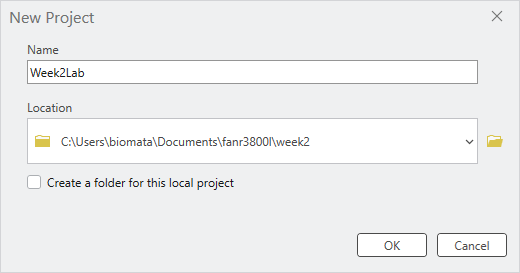

# FANR 3800 – Week 02 Lab Exercise
**My First Map: BF Grant Forest**

**ArcGIS Pro 3.7**

---

## IMPORTANT NOTE ABOUT VIDEOS AND THIS LAB

ELC videos demonstrate example workflows (e.g., symbolizing data, creating a project workspace). They are not step-by-step instructions for this specific lab. The videos may use different datasets or slightly different menu paths than what you see below. Follow the instructions in this document using the lab data provided on eLC.

Focus on the workflow, not on matching every button click exactly. The examples in the videos show you the general approach and logic - your job is to adapt that logic to your own data and achieve the same map structure and design.

> **Note:** This lab is designed for **ArcGIS Pro 3.7**. Some steps or menu locations may differ in other versions. If you are using a different version, contact your instructor.

---

## 1. THIS WEEK'S LAB DELIVERABLES

Upload the following **three items** to the *Week 02* assignment folder in eLC:

| Item | Description | Grade Weight |
|---|---|---|
| **ESRI Training Certificate** | *Introduction to Spatial Data* completion certificate (due by **Wednesday by 8:40AM**)| 50% |
| **Lab Map (JPEG)** | Week 02 *My First Map* exported JPEG matching the BF Grant Forest example layout (due by **Sunday at 11:59 PM**) | 40% |
| **Training Screenshot** | Screenshot of the map you create while working through the *Creating a Map Layout* ESRI Training module (due by **Sunday at 11:59 PM**) | 10% |

---

## 2. PURPOSE AND BACKGROUND

### 2.1 What this lab is about

This lab teaches you the complete workflow for creating a professional map in ArcGIS Pro - from organizing your workspace through data loading, symbolizing, layout design, and export. The emphasis is on understanding the why behind each step, not memorizing which exact button to click.

By the end of this lab, you will have:

- Created a properly organized GIS project workspace with consistent naming conventions.
- Loaded spatial data (shapefiles) into ArcGIS Pro using multiple methods.
- Symbolized map layers thoughtfully, focusing on the **CoverType** attribute as the basis for your story.
- Designed and assembled a professional map layout with all required elements.
- Exported a finished map product for communication and sharing.

### 2.2 The task

Create a map of the BF Grant Forest that closely matches the symbology and layout of the example provided at the end of this document. The stands must be symbolized by the **CoverType** attribute.

### 2.3 Required map elements

Professional maps in this course include:

- **Map frame** – the mapped area itself
- **Legend** – explanation of symbols and colors
- **Scale bar and scale text** – information about distance
- **North arrow** – orientation
- **Neatlines / map collar** – border around the map
- **Title** – brief description of what the map shows
- **Metadata** – author, data source, date, coordinate system (where applicable)
- **Inset map** – (optional for large-extent maps; not required for this lab)

> You should have already completed the *Creating a Map Layout* ESRI Training module before this lab. If not, do so now, paying special attention to the map layout elements section. The module will show you where these elements live in the ArcGIS Pro interface.

---

## 3. TOOLS AND WORKFLOWS PRACTICED THIS WEEK

This lab reinforces the following essential GIS practices:

### 3.1 Project Organization & File Management
- Creating and naming a course working directory (`FANR3800L`) and weekly subfolders (`Week02`).
- Establishing and following GIS-friendly file naming conventions (letters, numbers, underscores only; no spaces).
- **Why this matters:** Reproducible, organized projects are easier to share, archive, and adapt for future work.

### 3.2 ArcGIS Pro Interface Fundamentals
- Navigating the Ribbon, Contents pane, Map canvas, and Catalog pane.
- Understanding what each pane does and how they work together.
- **Why this matters:** Knowing the interface helps you find tools quickly and understand how ArcGIS is organized.

### 3.3 Data Discovery and Loading
- Locating shapefiles in the project Catalog.
- Adding data to a map using multiple methods (drag-and-drop, Add Data from Ribbon, Add Data from Contents pane).
- Establishing folder connections for efficient data access.
- **Why this matters:** Different contexts call for different methods; flexibility helps you work efficiently.

### 3.4 Layer Management
- Understanding drawing order (layers stack from top to bottom).
- Managing layer visibility with checkboxes.
- Rearranging layers so important features are visible and unobstructed.
- **Why this matters:** Layer order and visibility are critical for clear, readable maps.

### 3.5 Attribute-Driven Symbolization
- Examining attribute tables to identify fields suitable for mapping.
- Applying **Unique Values** symbology based on a chosen field (in this case, **CoverType**).
- Following symbology conventions (roads = black/gray, streams = blue, features = visible).
- Understanding polygon fill vs. outline symbolization targets.
- **Why this matters:** Symbolizing by attribute tells a visual story about your data; it connects the data to the map design.

### 3.6 Map Layout and Design
- Creating a new layout (standard 8.5" x 11" page).
- Placing a map frame and setting an appropriate extent using the Activate/Close Activation workflow.
- Inserting and positioning map elements (legend, title, scale, north arrow, neatlines, metadata).
- Cleaning up legend labels and organizing them logically.
- Using layout guides and smart snapping for professional alignment.
- **Why this matters:** A well-designed layout communicates information clearly and follows cartographic best practices.

### 3.7 Map Export and Product Delivery
- Exporting a layout as a JPEG using a standardized file naming scheme.
- Creating a finished product suitable for sharing with colleagues or managers.
- **Why this matters:** Exporting is how maps leave ArcGIS and enter the real world of reports, presentations, and decisions.

---

## 4. LAB INSTRUCTIONS

Follow these steps in order. Save your project frequently (\<CTRL-S>) (after each major step).

---

### STEP 1 – Review map design principles

Before you start clicking buttons, pause and think about why each map element matters.

**Discussion points to consider:**

- What is the purpose of a legend? How does it help someone who hasn't seen your data before?
- Why does a scale bar matter? In what situations would someone need to know distances on your map?
- What does a north arrow tell you? Why not just assume north is "up"?
- What should metadata include? Why is it important to know the data source and author?

> You have already worked through the *Creating a Map Layout* ESRI Training module. If you haven't, do that now.


---

### STEP 2 – Set up your workspace and download data

#### 2.1 Create your folder structure

Establish a consistent folder structure where you will keep all GIS projects and data for this course.

**Global naming conventions (you will see these on exams):**

- Use only lowercase letters (`a–z`), numbers (`0–9`), and underscores (`_`).
- No spaces or special characters: `! @ # $ % ^ & * ( ) - . , \ ? /`
- Names must start with a letter.
- Keep names short but meaningful:
  - ✓ `Forest_Boundary`
  - ✗ `try1`, `test_file2`, `My Map Final FINAL v3`

**Create your folders:**

1. Use File Explorer, navigate to the Documents and then create a new folder named `FANR3800L`.  This is your master Spatial workspace where you will save your work each week.
2. Still in File Explorer, create a new sub-folder named `Week02` for this week's lab exercise.  Next week you will create a `Week03` folder for the week 3 exercise.


**See the STEP 0 - File Explorer create your workspace video on eLC for a visual walkthrough.**

#### 2.2 Download and extract the lab data

1. Go to eLC → **Week 02 – Lab** folder.
2. Download `Week02_Lab_Data.zip` (or similar file name).
3. Downloads default to the Downloads folder. Use the File Explorer to copy the zipped file over to your `Week02` folder.
4. Extract/unzip the file:
   - In File Explorer:  Right-click on the zipped file → **Extract All** (or 7-Zip → Extract All if available).

After extraction, your `Week02` folder should contain a subfolder called `BFGrant` with shapefiles inside (`.shp`, `.dbf`, `.shx`, etc.).

**See the STEP 2 video on eLC for a visual walkthrough.**

---

### STEP 3 – Create a new ArcGIS Pro project

#### 3.1 Launch ArcGIS Pro and create a new map

1. Open **ArcGIS Pro** (click the application icon on your desktop or start menu).
2. Under **New**, click the **Map** template.
3. In the *Create a New Map* dialog:
   - **Name:** Type something meaningful, e.g., `Week2Lab`.
   - **Location:** Set to your `Week02` folder (use the file/browse button to navigate to this week's lab folder - *This PC>Documents>fanr3800l>week02*).
   - **Uncheck the box labeled "Create a new folder for this project."**
   - Click **OK**.



ArcGIS Pro will open with a blank map.


#### 3.2 Explore the interface

Take a moment to locate and understand these key areas:

| Area | Location | Purpose |
|---|---|---|
| **Ribbon** | Top of window | Menus and tools (like File, Edit, Map, Insert, etc.) |
| **Contents pane** | Left side | Lists your map layers and controls their visibility/order |
| **Map canvas** | Center | Where you see and interact with your mapped data |
| **Catalog pane** | Right side (tab) | Browser for folders, files, and project resources |

#### 3.3 Locate your data in the Catalog

1. Click the **Catalog** tab (right side, if not already visible).
2. Expand **Folders** by clicking the arrow next to it.
3. Navigate to your project folder: expand `Week2Lab` (or your project name).
4. Expand the `BFGrant` folder - this is where your shapefiles are stored.

You should see files like:
- `stands.shp`
- `roads.shp`
- `streams.shp`
- `nests.shp`

#### 3.4 Add data to your map

**Choose one of the three methods below (or try multiple):**

**Method A: Drag and drop** (Most efficient in ArcGIS Pro 3.7)
- In the **Catalog** pane, find your `.shp` files under `BFGrant`.
- Drag and drop each one onto the map canvas.

**Method B: Add Data from the Ribbon** (Most discoverable for new users)
- On the **Map** ribbon tab, click the **+** symbol next to "Add Data."
- In the dialog, navigate to `Folder > Week2Lab > BFGrant`.
- Select the shapefiles you want and click **OK**.

**Method C: Add Data from the Contents pane** (Most context-aware)
- In the **Contents** pane, right-click the **Map** entry.
- Click **Add Data.**
- Navigate to `Week2Lab > BFGrant` and select your shapefiles.

> You do not need to memorize all three methods. The goal is to see that ArcGIS offers multiple valid workflows. In future labs, pick whichever feels fastest or most intuitive to you.


**SAVE YOUR PROJECT** (Ctrl+S or File > Save).

**Checkpoint:** Verify that all four shapefiles (stands, roads, streams, nests) are now listed in the Contents pane on the left.

**See the STEP 3 video on eLC for a visual walkthrough.**

---

### STEP 4 – Symbolize your layers

Your goal this week is to recreate the *Week02_MapLayoutTemplate* map I've linked in this week's eLC lab section, where stands are colored by **CoverType**, roads are black or gray, streams are blue, and nests are a simple, visible point symbol.

#### 4.1 Understand drawing order and visibility

Layers in the **Contents** pane are drawn in order from top to bottom.

- **To change layer order:** Click and drag a layer up or down in the Contents pane.
- **To show/hide a layer:** Check or uncheck the box next to its name.

If a layer is checked but invisible on the map, it may be buried beneath other layers. Drag it to the top to see it.

**Pro Tip:** You can also lock a layer to prevent accidental reordering by right-clicking it in the Contents pane and selecting **Lock.**

> Play with layer order and visibility to understand how they affect what you see on the map.

#### 4.2 Apply basic symbology (roads, streams, nests)

1. Right-click the **roads** layer in the **Contents** pane.
2. Click **Symbology.**
3. The **Symbology** pane opens on the right (replace the Catalog pane).
4. Under **Primary Symbology:**
   - Click the symbol (usually a colored line or shape).
   - A gallery of symbols appears.
   - Choose a line symbol appropriate for roads (e.g., a solid black or gray line).
   - Click on the symbol to apply it, or click **Apply** at the bottom of the pane to see it on the map without closing the pane.

5. Repeat for **streams** (choose a blue line) and **nests** (choose a simple point symbol that is easy to see).

**Pro-tips:**

- To test your changes without closing the Symbology pane, click **Apply** instead of **OK.**
- To quickly change a layer's color, click the small colored symbol next to the layer name in the **Contents** pane.
- Note: For POLYGON features like stands, you will be choosing a fill color and outline. For LINE features like roads and streams, you are choosing a line color and thickness. The Symbology pane shows different options based on geometry type.

#### 4.3 Symbolize stands by CoverType (unique values)

This is where you will apply the most sophisticated symbolization: mapping stands by the **CoverType** attribute.

**4.3.1 Examine the stands attribute table**

1. Right-click the **stands** layer in the **Contents** pane.
2. Click **Attribute Table.**
3. A table opens at the bottom of the screen showing all attributes (columns) for each stand (row).
4. Scroll right to find the **CoverType** column. Note the values (e.g., Deciduous, Conifer, Mixed, etc.).

> **Conceptual checkpoint:** Ask yourself: *Why is CoverType a good field to symbolize? What does it tell us about the forest?* This is more important than the colors you choose.

**4.3.2 Apply Unique Values symbology**

1. Right-click the **stands** layer → **Symbology.**
2. Under **Primary Symbology**, click the dropdown that currently says **Single Symbol.**
3. Choose **Unique Values.**
4. A **Field 1** option appears. Set it to **CoverType.**
5. Click the **Classes** tab.
6. A list of CoverType values will appear (e.g., Conifer, Deciduous, Mixed, Open).
7. Each value will get a different color automatically. The symbology updates on your map.

**CRITICAL STEP – Color Scheme Targeting (ArcGIS Pro 3.7):**

8. Change the **Color Scheme** to something appropriate for forest cover types (e.g., greens, with variation).

   **Important:** In ArcGIS Pro 3.7, you must tell the software whether to apply colors to polygon fills, outlines, or both:

   - Look for the **Color Scheme Options** button (⚙️ gear icon) located next to the **Color Scheme** dropdown.
   - Click the gear icon to open the Color Scheme Options dialog.
   - Select **Apply to fill** (this is the standard choice for forest cover type maps).
   - Click **OK**.

   Your polygon stands should now display as filled, colored shapes representing different cover types. If your stands appear as thin colored lines only, you applied the colors to outlines instead. Repeat this step and select **Apply to fill.**

**4.3.3 Clean up your symbolization**

1. In the Symbology pane, go to the **Classes** tab.
2. For each CoverType value, you can edit the **Label** (the name that will appear in the legend):
   - Double-click or click the label cell to edit it.
   - Example: If the data says `pine`, you might label it `Pine (loblolly)` for clarity.

> **Note on "All Other Values":** At the bottom of the symbol class list, you may see an entry labeled **<all other values>** colored gray. This is a catch-all class that captures any stands with blank/NULL CoverType values or unexpected values not listed above. If all your stands appear in the main classes (Conifer, Deciduous, etc.) and none show as gray, you don't need to worry about this. But if you see gray stands on your map, right-click the stands layer → **Attribute Table** and check those features' CoverType values to diagnose data quality issues.

> Use the attribute table and the example map at the end of this document to guide your labeling.

**Pro Tip – Show Count:** In the Symbology pane, click **More** and select **Show count** to display how many features belong to each cover type in your legend. This helps you understand feature distributions.

**4.3.4 Turn off background imagery**

- In the **Contents** pane, find a layer called **World Imagery** (or similar basemap).
- Uncheck the box next to it to hide the satellite background.
- This makes your stand colors more prominent.

**SAVE YOUR PROJECT** (Ctrl+S).

**See the STEP 4 video on eLC for a visual walkthrough.**

---

### STEP 5 – Create your map layout

A map layout is a designed page (like in PowerPoint) that includes your map plus the legend, scale, title, and other elements. This is what you will export as a finished product.

#### 5.1 Create a new layout

1. Click the **Insert** ribbon tab at the top.
2. Click **New Layout.**
3. Select **8.5" × 11"** (standard letter size in portrait).

A new tab called **Layout** appears. You are now in the layout editor.

**Professional Tip – Adding Guides:**

To help you align your map frame, legend, and other elements professionally, add guides to the layout:

1. Right-click the ruler at the top of the layout.
2. Click **Add Multiple Guides.**
3. Set **Orientation** to **Both** (adds horizontal and vertical lines).
4. Set **Placement** to **Offset from edge** and **Margin** to **0.25 in.**
5. Click **OK.**

These blue dashed lines will help you snap elements to consistent margins. When you drag elements on the layout, you'll see them snap to these guides and to each other (smart guides), making professional alignment easier.

#### 5.2 Add the map frame (your mapped area)

1. On the **Insert** ribbon, click **Map Frame.**
2. A dialog appears asking which map to use. Select **Default Extent** (or the name of your map).
3. Move your mouse to the layout and draw a rectangle where you want the map to appear.
   - Leave room around the edges for legend, title, scale bar, and metadata.
   - A good starting point is to leave approximately 2 inches on the right for a legend and approximately 1 inch at the bottom for scale/metadata.

#### 5.3 Set the map extent (zoom level) – Activate/Close Activation Workflow

The map frame will show your data at a default zoom level. You likely want to zoom to your stands (the main feature of interest).

**Important Change from Previous Versions:** ArcGIS Pro 3.7 uses the Activate/Close Activation workflow rather than tab switching. This keeps everything in the layout context:

1. On your **Layout** tab, right-click the **MAP FRAME** (the white rectangle showing your map).

2. Click **Activate.**

   You'll notice:
   - Selection handles appear around the map frame
   - The ribbon changes to show the **Map** tab with zoom/pan tools
   - You're now in "map editing mode" within the layout context

3. In the **Contents** pane, right-click the **stands** layer and select **Zoom to Layer.**

   The map data within the layout frame zooms to show just the stands.

4. Use the pan and zoom tools on the ribbon to adjust the view as needed (e.g., zoom out slightly to show context with roads and streams).

5. When you're satisfied with the extent, right-click the map frame again and click **Close Activation.**

   You're back to layout editing mode and can now add legends, titles, etc.

**Advantage:** Everything happens in the layout view. You don't lose context by switching tabs.

> **Optional:** Experiment by zooming to other layers (roads, streams, nests) to see how the layout changes. This helps you understand the role of extent in map design.

**SAVE YOUR PROJECT.**

#### 5.4 Add map elements

On the **Insert** ribbon, you will find tools to add each element. Add them in any order; position them carefully on your layout.

**5.4.1 Legend**

1. Click **Insert → Legend.**
2. Draw a box on your layout (usually on the right or bottom) where you want the legend.
3. The legend appears automatically, listing all layers.
4. To control which layers appear:
   - In the **Contents** pane, expand **Layout** (if not already expanded).
   - Expand **Legend** (or the name of your legend).
   - Expand **Map Frame** below it.
   - You will see a list of layers under **Map Frame**. To add a layer to the legend, drag it up into the **Legend** section. To remove it, drag it out.

5. **Clean up layer names:**
   - The legend may show file names like `Bfg_roads` or `stands`. To make it more readable:
   - Under **Map Frame** in the **Contents** pane, right-click each layer.
   - Click **Properties → Name** and change it (e.g., `Bfg_roads` → `Roads`, `stands` → `Cover Type Stands`).
   - The legend updates automatically.

6. **Edit CoverType labels in the legend:**
   - Go back to your **Map** tab.
   - Right-click the **stands** layer → **Symbology.**
   - In the **Classes** tab, click each CoverType value and edit its **Label** to be more descriptive (e.g., `Conifer` instead of just the data code).
   - Return to **Layout** tab. The legend updates.

7. **Optional: Create a second legend** if you want stands in one legend and other layers in another:
   - Insert another legend (Insert → Legend).
   - In the **Layout** section of **Contents**, manage which layers appear in which legend by dragging them between legend entries.

**Advanced Tip – Legend Fitting Strategies:** If your legend is too long or doesn't fit well on the page, you can adjust its fitting strategy. Right-click the legend in the Contents pane (under Layout), click **Properties**, and on the Element pane, look for **Fitting Strategy.** You can choose to flow legend items left-to-right, adjust columns, or auto-fit the legend to available space.

**Advanced Tip – Legend Headings:** To further organize your legend, you can group similar cover types under headings. In the Symbology pane, select multiple symbol classes (Ctrl+click), right-click, and choose **Move to heading.** This creates a collapsible section in the legend. (Optional for Week 2.)

**Remember:** If you turn off a symbol class in the Symbology pane (using the checkboxes), that class is hidden both on the map and in the legend. If you want a layer to appear on the map but not in the legend, use a different approach (e.g., copy the layer or use a separate legend layer).

**5.4.2 Title**

1. On the **Insert** ribbon, find the **Text** tools (text box icon, usually on the left).
2. Click the text box and draw a box at the top of your layout.
3. Type a descriptive title (e.g., "BF Grant Forest Cover Types" or "Forest Stand Classification").
4. To format the title:
   - Right-click it → **Properties** (or look for an **Element** pane on the right).
   - Adjust **Font**, **Size**, **Color**, and **Background** (border, fill).

**5.4.3 Scale Bar**

1. On the **Insert** ribbon, click the arrow next to **Scale Bar.**
2. Choose a scale bar style (any simple one is fine).
3. Draw it on your layout (bottom left or bottom right, below the map).
4. Right-click the scale bar → **Properties** (or find it in the **Layout Contents** pane).
5. Look for an option to set **Map Units** (e.g., feet, miles, meters).
   - To confirm the map units of your data, right-click the stands layer in the Contents pane, select **Properties**, and look at the **Spatial Reference** or **Extent** section. This shows you the native units of your data. If your data is in UTM (meters), the scale bar should be in meters or kilometers.
   - For BF Grant, feet or meters is typical. Ask your instructor if unsure.
6. Adjust text size under **Text Symbol** if it is hard to read.

**5.4.4 Scale Text**

1. On the **Insert** ribbon, under **Dynamic Text**, click **Scale.**
2. Draw a small text box next to or below the scale bar.
3. This box will automatically display the map's scale ratio (e.g., "1:10,000").
4. Adjust font size if needed.

**5.4.5 North Arrow**

1. On the **Insert** ribbon, click the arrow next to **North Arrow.**
2. Choose a simple arrow style.
3. Draw it on your layout (typically upper right, or wherever it does not clutter the map).

**5.4.6 Neatline / Map Collar (Border)**

1. On the **Insert** ribbon, find the **Rectangle** tool (usually grouped with other shape tools).
2. Draw a rectangle around the entire layout to create a border.
3. Right-click it → **Properties** to adjust the line color and thickness (a simple black line is standard).

**5.4.7 Metadata Text Box**

1. Insert a text box (same as title; see 5.4.2).
2. Draw it at the bottom or corner of your layout (a small area).
3. Type your metadata. Use the following template as a guide:

   ```
   Data Source: BF Grant Forest Database
   Author: [Your Name]
   Date: January 2026
   Course: FANR 3800
   Map Projection: [Specify if known, e.g., UTM Zone 10N, NAD 1983]
   ```

4. Adjust font size so it is readable but not dominant.

**Standard Metadata Elements Required:**
- Author (your name)
- Course Number (FANR 3800)
- Data Source (BF Grant Forest Database)
- Date (date created)
- Coordinate System / Map Projection (if known)

**See the STEP 5 video on eLC for a visual walkthrough.**

#### 5.5 Final layout review

- Step back and look at your layout as a whole. Is it clear? Are all elements readable?
- Can someone who has never seen this data understand what the map shows?
- Do the colors make sense for forest cover types?
- Is the legend easy to find and interpret?
- **Smart Guides Tip:** As you drag elements on the layout, you'll see blue dashed lines appear - these are smart guides helping you align with other elements. You can also enable a snap grid or ruler guides for more precise placement.

**SAVE YOUR PROJECT** (Ctrl+S).

---

### STEP 6 – Export your map and submit deliverables

#### 6.1 Export your layout as a JPEG

1. On the **Layout** tab, click the **Share** ribbon.
2. Under **Export**, click the green **Layout** button (or similar export button).
3. A dialog opens. Set:
   - **File Type:** JPEG
   - **Output Location:** your `Week02` folder (use the folder icon to navigate).
   - **File Name:** `Week2Lab_YOURLASTNAME.jpg`
     - Example: `Week2Lab_Lowe.jpg`
     - **TODO (clarification):** Confirm file naming convention with course policy. Is `Week2Lab_YOURLASTNAME.jpg` or `YOURLASTNAME_Week2Lab.jpg` preferred?
   - **Resolution (optional):** Default resolution (96 DPI) is suitable for screen viewing. If you plan to print the map, increase the DPI to 300 or higher for better quality.

4. Click **Export.**

Your map is now saved as a JPEG in your Week02 folder - this is a finished product you can email, print, or include in a report.

**Verification Step:** After exporting, navigate to your Week02 folder in File Explorer to confirm the JPEG file was created. Open it to verify the map, legend, and all elements are visible and properly positioned.

**SAVE YOUR PROJECT.**

#### 6.2 Reflective prompt (important for learning)

Before you upload your map layout, take a few minutes to reflect on the workflow you just completed.

**Reflective Question:**

> In this lab, I provide both text and video instructions guiding you through common workflows for 1) creating a new project workspace (creating project folder and copying and extracting project data to that folder using File Explorer), 2) controlling the order in which geospatial data layerss are shown on the map, 3) purposefully symbolizing your geospatial data, and 4) generating a map layout. Provide a 2-3 sentence summary of each step mentioned above. Focus on the task (creating a new project workspace, reordering the display order, symbolizing data layers, creating a map layout), not on the exact button names or menues you click. I recommend also referencing the video and timestamp for parts of a video that you find particularly helpful. While you do not need to submit these to eLC, I expect that they will be useful the next time I ask you to create a map layout or you need to symbolize a data layer in a certain manner.


---

## 5. KEY GIS WORKFLOWS PRACTICED THIS WEEK

This week you practiced the complete map-making workflow, which you will repeat (and extend) all semester:

1. **Organize** your workspace (folders, naming conventions).
2. **Load** spatial data into ArcGIS Pro (multiple methods).
3. **Manage** layers (drawing order, visibility).
4. **Symbolize** based on attributes and purpose (single vs. unique values).
5. **Design** a layout with all required map elements.
6. **Export** a finished product.

---

## 6. FINAL DELIVERABLES CHECKLIST

Upload the following **three items** to the *Week 02 Lab* folder on eLC:

### 6.1 Required uploads

- [ ] **ESRI Training Certificate - due Wednesday at 8:40 AM**
  - *Introduction to Spatial Data* completion certificate (50% of grade)
  - Format: PDF or screenshot as provided by ESRI

- [ ] **Lab Map JPEG - due Sunday at 11:59 PM**
  - File name: `Week2Lab_YOURLASTNAME.jpg` (e.g., `Week2Lab_Lowe.jpg`)
  - Shows BF Grant Forest stands symbolized by CoverType with all required map elements (40% of grade)

- [ ] **Creating a Map Layout Screenshot - due Sunday at 11:59 PM**
  - Screenshot from the *Creating a Map Layout* ESRI Training module (10% of grade)

### 6.2 What NOT to submit

- Do not submit your ArcGIS Pro project file (`.aprx`).
- Do not submit the original shapefiles.
- Only submit the JPEG, certificate, and screenshot as listed above.

---

## APPENDIX: REFERENCE MAP

See the `Week02_MapLayoutTemplate` linked in this week's eLC lab section for an example of how I want you to design your map layout. Use this as a design guide, but understand that your map does not need to match it pixel-for-pixel. As long as you:

- Symbolize stands by **CoverType** (with appropriate colors),
- Include all required map elements (legend, scale, title, north arrow, neatlines, metadata) - I recommend using my template design, and
- Create a clear, readable layout,

your map will meet the objectives.


---

**Questions? Contact your instructor or TA during office hours or via eLC.**

**Last updated: August 2026**
